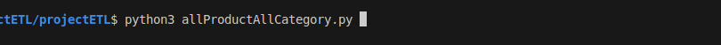
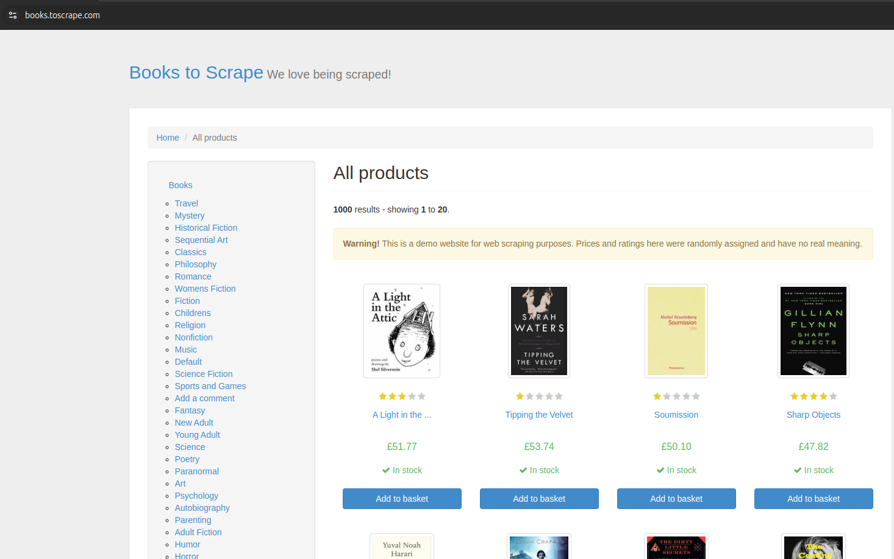

# projectETL
This program scrape the website "http://books.toscrape.com". It downloads all the products's informations (books) of the site, and store them in csv's files with their images.

## Libraries
This program is developped with python 3.12.3. It use as Libraries : Requests, Csv and bs4 (BeautifulSoup)

## Running 
 cd to the directory then run : python3 allProductAllCategory.py

## the output : 
    - csvFiles : contains csv's files, each file refer to a category, a file contains all products of the category, the name of the file and the category is the same 
    - jpgsFiles: contains a directory for each category, a directory contain all imgs of all products of the category, the name of the img and the product is the same

## Screenshot

